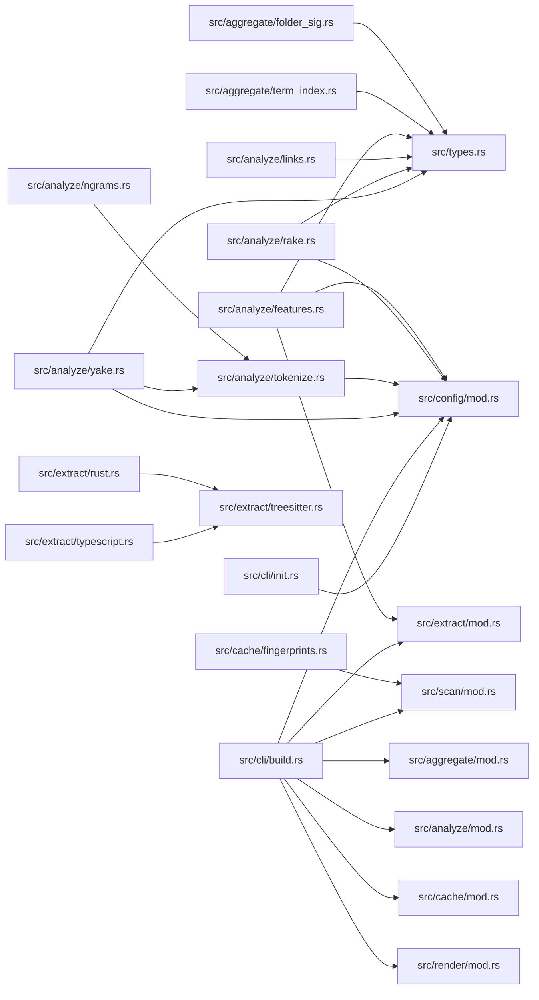

# Knowledge Base Connections

_Auto-generated map of internal file connections. Use this to find hubs and orphans._

## Hub Files (Most Referenced)

- **src/types.rs** (15 inbound links)
- **src/config/mod.rs** (11 inbound links)
- **src/analyze/tokenize.rs** (2 inbound links)
- **src/extract/mod.rs** (2 inbound links)
- **src/extract/treesitter.rs** (2 inbound links)
- **src/scan/mod.rs** (2 inbound links)
- **src/aggregate/mod.rs** (1 inbound links)
- **src/analyze/mod.rs** (1 inbound links)
- **src/cache/mod.rs** (1 inbound links)
- **src/render/mod.rs** (1 inbound links)

## Orphan Files (No Connections)

- README.md
- src/analyze/tfidf.rs
- src/cli/clean.rs
- src/cli/doctor.rs
- src/cli/mod.rs
- src/cli/scan.rs
- src/extract/markdown.rs
- src/extract/plaintext.rs
- src/lib.rs
- src/main.rs

## Connection Graph

